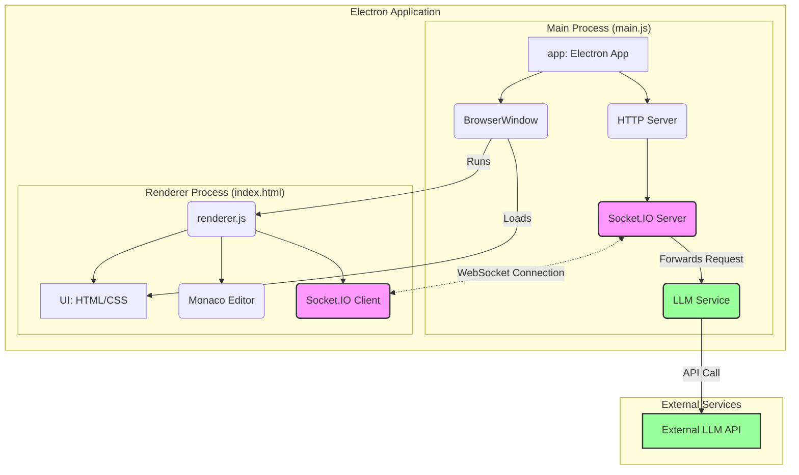
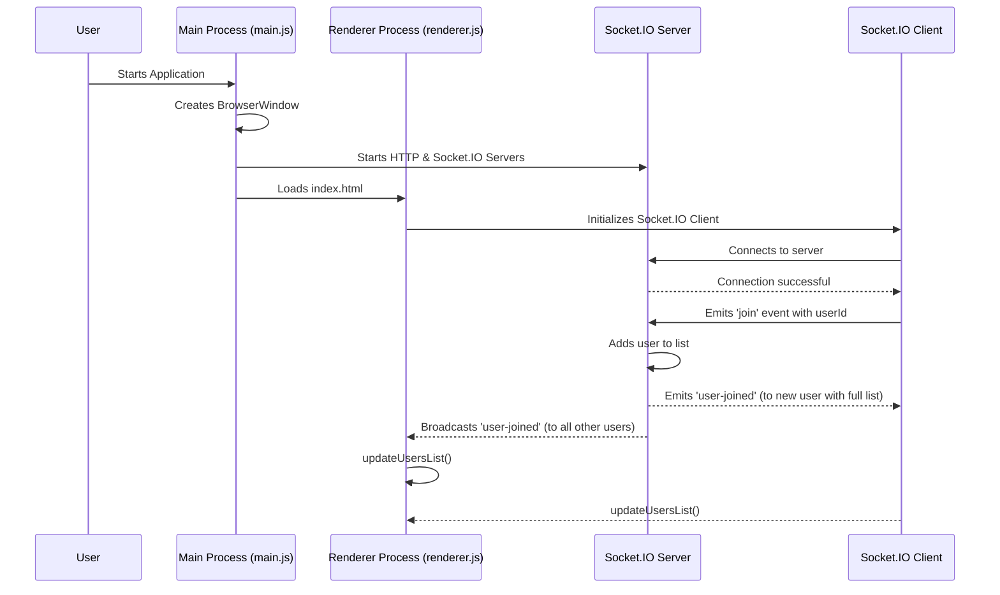
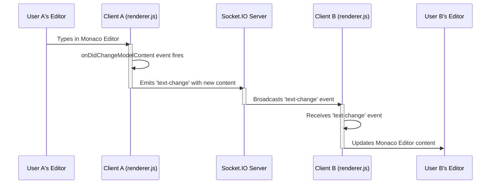
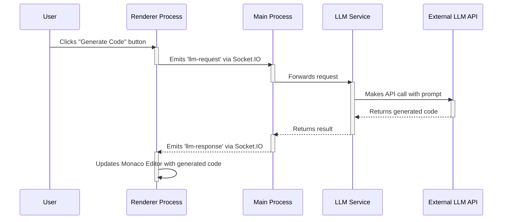

# Collaborative Text Editor Documentation

This document provides an overview of the architecture and functionality of the collaborative text editor application.

## Project Architecture

The application is built using Electron, which allows us to create a desktop application with web technologies. It is composed of two main processes: the Main process and the Renderer process.

### 1. Electron Architecture

*   **Main Process (`main.js`):** This is the backbone of the application. It runs a full Node.js environment and is responsible for creating and managing application windows (`BrowserWindow`), handling native OS events, and running the server-side logic for collaboration.

*   **Renderer Process (`renderer.js` & `index.html`):** This is the user interface. It's a web page running in a sandboxed Chromium browser environment. It handles the presentation layer, including the text editor and user list.

### 2. Server Components (within the Main Process)

*   **Node.js `http` Server:** A standard HTTP server using Node's built-in `http` module. Its primary role is to act as a host for the Socket.IO server to attach to.

*   **Socket.IO Server:** This is the core of our real-time collaboration. It attaches to the `http` server and listens for WebSocket connections from clients. It manages user connections, receives events (like text changes), and broadcasts those events to all other connected clients.

### 3. Client Components (within the Renderer Process)

*   **Monaco Editor:** A powerful code editor component from VS Code that provides the rich text editing UI. It has its own internal state and emits events when the user types or makes changes.

*   **Socket.IO Client:** This component, running in `renderer.js`, connects to the Socket.IO server in the main process. It's responsible for sending the user's text changes to the server and listening for changes from other users to update the local Monaco Editor instance.

## Static Component Diagram

This diagram illustrates the static architecture of the application, showing the main components and their relationships, including the integration of an external LLM.



### Explanation of the Component Diagram

1.  **Main Process (Top Box):**
    *   The Electron `app` starts everything and creates the `BrowserWindow`.
    *   It runs a `Socket.IO Server` for real-time communication.
    *   Crucially, it contains the **`LLM Service`**. This component is responsible for securely making API calls to an external LLM. This keeps API keys and sensitive logic off the client-side.

2.  **Renderer Process (Bottom Box):**
    *   The `BrowserWindow` loads the `UI` and runs `renderer.js`.
    *   `renderer.js` initializes the `Monaco Editor` and the `Socket.IO Client`. User actions that require AI assistance will trigger events sent through this client.

3.  **Key Interactions:**
    *   **WebSocket Connection:** Real-time collaboration (text-sync, user presence) happens via the WebSocket connection between the `Socket.IO Client` and `Server`.
    *   **LLM API Call:** When a user requests an AI action, the request flows from the `Socket.IO Client` to the `Server`, which forwards it to the `LLM Service`. This service then makes a secure, server-to-server call to the **`External LLM API`**. The response flows back along the same path.

## Use Cases

### Use Case 1: User Joins a Session

This sequence diagram illustrates the flow of events when a user starts the application and connects to the collaborative session.



**Explanation of the "User Joins" Sequence:**

1.  **Initialization:** The `User` starts the application. The `Main Process` creates the `BrowserWindow` and starts the `Socket.IO Server`. The `BrowserWindow` then loads the `Renderer Process`.
2.  **Connection:** The `Renderer Process` initializes the `Socket.IO Client`, which establishes a connection with the `Socket.IO Server`.
3.  **Joining:** Once connected, the client sends a `join` event to the server, identifying itself with a unique `userId`.
4.  **Server Response:** The server adds the new user to its list of connected clients. It then does two things:
    *   It sends a `user-joined` event directly back to the new user, containing the *entire list* of currently connected users.
    *   It broadcasts a `user-joined` event to *all other* connected users, informing them that a new user has arrived.
5.  **UI Update:** All clients (both the new one and the existing ones) receive the `user-joined` event and call the `updateUsersList()` function to refresh the user list displayed in the sidebar.

### Use Case 2: Text Change Synchronization

This sequence diagram shows how a change made by one user is propagated to all other users in the session.



**Explanation of the "Text Change" Sequence:**

1.  **User A Makes a Change:** `User A` types into their instance of the `Monaco Editor`.
2.  **Client A Detects Change:** The `onDidChangeModelContent` event listener in `Client A`'s `renderer.js` is triggered.
3.  **Client A Emits Change:** `Client A` packages the new editor content and its `userId` into a `text-change` event and sends it to the `Socket.IO Server`.
4.  **Server Broadcasts Change:** The `Server` receives the `text-change` event and immediately broadcasts it to all *other* connected clients. It's important that it doesn't send the message back to the original sender (`Client A`) to avoid an infinite loop.
5.  **Client B Receives Change:** `Client B`'s `Socket.IO Client` receives the incoming `text-change` event.
6.  **Client B Updates Editor:** The event handler in `Client B`'s `renderer.js` is triggered. It checks that the change is from a different user and then programmatically updates the content of its local `Monaco Editor` (`User B's Editor`) with the new text.

### Use Case 3: LLM Code Generation

This sequence diagram illustrates how a user would interact with the LLM to generate code.



**Explanation of the "LLM Code Generation" Sequence:**

1.  **User Action:** The `User` clicks a button in the UI to trigger an AI action.
2.  **Client Request:** The `Renderer Process` sends an `llm-request` event over Socket.IO to the `Main Process`. The event would contain the current code or a specific prompt.
3.  **Server-Side Handling:** The `Main Process` receives the request and passes it to the dedicated `LLM Service`.
4.  **External API Call:** The `LLM Service` securely calls the `External LLM API`, sending the prompt.
5.  **Response Handling:** The `LLM Service` receives the generated code from the API and passes it back to the `Main Process`.
6.  **Update Client:** The `Main Process` sends the result back to the `Renderer Process` in an `llm-response` event.
7.  **UI Update:** The `Renderer Process` receives the response and updates the Monaco Editor with the new code.

### Use Case 4: LLM Task with Tool Execution

This diagram illustrates a more advanced scenario where the LLM uses local tools to accomplish a complex task.

```mermaid
sequenceDiagram
    participant User
    participant RendererProcess as Renderer Process
    participant AgentOrchestrator as Agent Orchestrator (in Main Process)
    participant LocalTools as Local Tools (in Main Process)
    participant ExternalAPI as External LLM API

    User->>RendererProcess: Initiates complex task (e.g., "Refactor this function")

    activate RendererProcess
    RendererProcess->>AgentOrchestrator: Emits 'llm-task' via Socket.IO
    deactivate RendererProcess

    activate AgentOrchestrator
    loop Reasoning & Tool-Use Loop
        AgentOrchestrator->>ExternalAPI: Sends prompt (with task + tool results)
        
        activate ExternalAPI
        ExternalAPI-->>AgentOrchestrator: Responds with final answer OR tool_call
        deactivate ExternalAPI

        alt LLM requests a tool
            AgentOrchestrator->>LocalTools: Parses request and executes the specified tool
            
            activate LocalTools
            LocalTools-->>AgentOrchestrator: Returns result of the tool execution
            deactivate LocalTools
        else LLM provides final answer
            AgentOrchestrator-->>RendererProcess: Sends final answer via Socket.IO
            break
        end
    end
    deactivate AgentOrchestrator

    activate RendererProcess
    RendererProcess->>RendererProcess: Updates UI with final answer
    deactivate RendererProcess
```

**Explanation of the "LLM Task with Tool Execution" Sequence:**

1.  **Task Initiation:** A user gives a complex command that requires file system access or context beyond the current view.
2.  **Orchestration:** The request is sent to the `Agent Orchestrator` in the main process. This orchestrator manages the entire multi-step conversation with the LLM.
3.  **Reasoning Loop:**
    *   The orchestrator sends the task and any available context (like previous tool outputs) to the `External LLM API`.
    *   The LLM analyzes the request and may respond with a `tool_call`, asking for more information.
    *   The `Agent Orchestrator` executes the requested `Local Tool` (e.g., reading a file or running a search) securely in the Main Process.
    *   The tool's output is sent back to the LLM in the next turn of the loop, providing it with the context it needs.
    *   This loop continues until the LLM has gathered enough information to generate a final answer.
4.  **Final Response:** Once the loop is complete, the final answer (e.g., the refactored code) is sent back to the `Renderer Process` to be displayed to the user.
