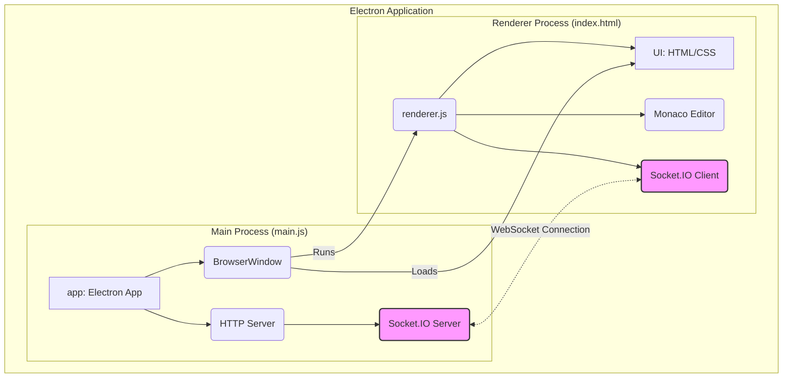
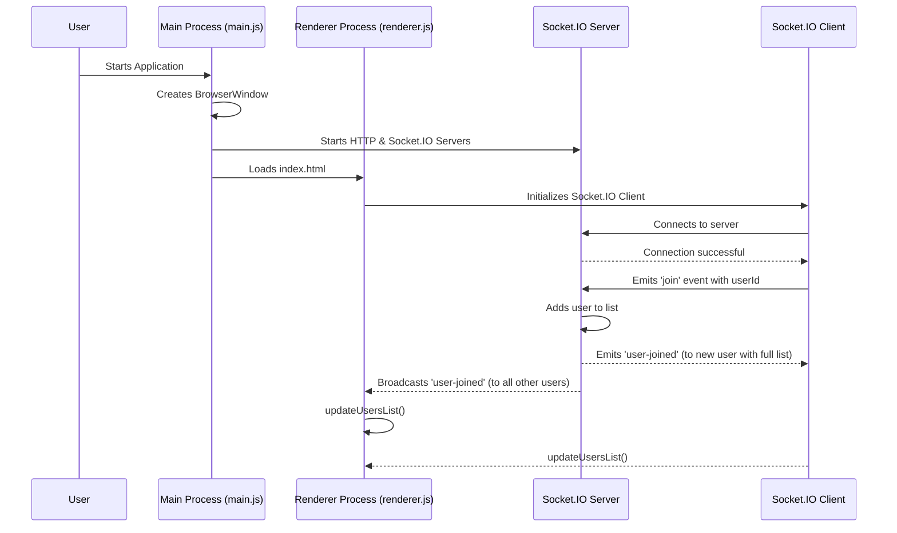
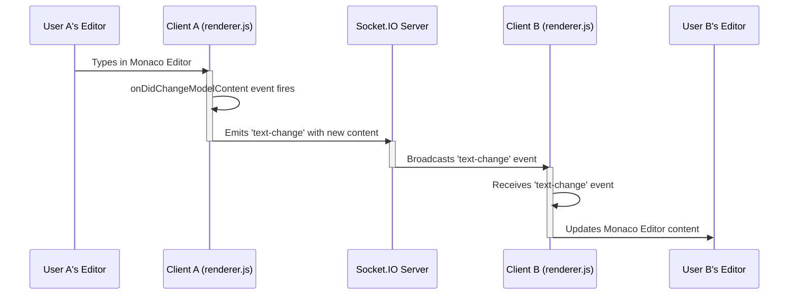

# Collaborative Text Editor Documentation

This document provides an overview of the architecture and functionality of the collaborative text editor application.

## Project Architecture

The application is built using Electron, which allows us to create a desktop application with web technologies. It is composed of two main processes: the Main process and the Renderer process.

### 1. Electron Architecture

*   **Main Process (`main.js`):** This is the backbone of the application. It runs a full Node.js environment and is responsible for creating and managing application windows (`BrowserWindow`), handling native OS events, and running the server-side logic for collaboration.

*   **Renderer Process (`renderer.js` & `index.html`):** This is the user interface. It's a web page running in a sandboxed Chromium browser environment. It handles the presentation layer, including the text editor and user list.

### 2. Server Components (within the Main Process)

*   **Node.js `http` Server:** A standard HTTP server using Node's built-in `http` module. Its primary role is to act as a host for the Socket.IO server to attach to.

*   **Socket.IO Server:** This is the core of our real-time collaboration. It attaches to the `http` server and listens for WebSocket connections from clients. It manages user connections, receives events (like text changes), and broadcasts those events to all other connected clients.

### 3. Client Components (within the Renderer Process)

*   **Monaco Editor:** A powerful code editor component from VS Code that provides the rich text editing UI. It has its own internal state and emits events when the user types or makes changes.

*   **Socket.IO Client:** This component, running in `renderer.js`, connects to the Socket.IO server in the main process. It's responsible for sending the user's text changes to the server and listening for changes from other users to update the local Monaco Editor instance.

## Static Component Diagram

This diagram illustrates the static architecture of the application, showing the main components and their relationships.

### Explanation of the Component Diagram

1.  **Main Process (Top Box):**
    *   The Electron `app` starts everything.
    *   It creates a `BrowserWindow`, which is the visible application window.
    *   It also creates an `HTTP Server`, which hosts the `Socket.IO Server`. This entire server stack runs within the main process.

2.  **Renderer Process (Bottom Box):**
    *   The `BrowserWindow` loads the `UI` from `index.html` and runs the logic from `renderer.js`.
    *   `renderer.js` is the orchestrator on the client-side: it initializes the `Monaco Editor` and the `Socket.IO Client`.

3.  **Key Interaction (Dotted Line):**
    *   The most critical link for collaboration is the **WebSocket Connection** between the `Socket.IO Server` (in the main process) and the `Socket.IO Client` (in the renderer process). This is how real-time messages are passed back and forth.

## Use Cases

### Use Case 1: User Joins a Session

This sequence diagram illustrates the flow of events when a user starts the application and connects to the collaborative session.

**Explanation of the "User Joins" Sequence:**

1.  **Initialization:** The `User` starts the application. The `Main Process` creates the `BrowserWindow` and starts the `Socket.IO Server`. The `BrowserWindow` then loads the `Renderer Process`.
2.  **Connection:** The `Renderer Process` initializes the `Socket.IO Client`, which establishes a connection with the `Socket.IO Server`.
3.  **Joining:** Once connected, the client sends a `join` event to the server, identifying itself with a unique `userId`.
4.  **Server Response:** The server adds the new user to its list of connected clients. It then does two things:
    *   It sends a `user-joined` event directly back to the new user, containing the *entire list* of currently connected users.
    *   It broadcasts a `user-joined` event to *all other* connected users, informing them that a new user has arrived.
5.  **UI Update:** All clients (both the new one and the existing ones) receive the `user-joined` event and call the `updateUsersList()` function to refresh the user list displayed in the sidebar.

### Use Case 2: Text Change Synchronization

This sequence diagram shows how a change made by one user is propagated to all other users in the session.

**Explanation of the "Text Change" Sequence:**

1.  **User A Makes a Change:** `User A` types into their instance of the `Monaco Editor`.
2.  **Client A Detects Change:** The `onDidChangeModelContent` event listener in `Client A`'s `renderer.js` is triggered.
3.  **Client A Emits Change:** `Client A` packages the new editor content and its `userId` into a `text-change` event and sends it to the `Socket.IO Server`.
4.  **Server Broadcasts Change:** The `Server` receives the `text-change` event and immediately broadcasts it to all *other* connected clients. It's important that it doesn't send the message back to the original sender (`Client A`) to avoid an infinite loop.
5.  **Client B Receives Change:** `Client B`'s `Socket.IO Client` receives the incoming `text-change` event.
6.  **Client B Updates Editor:** The event handler in `Client B`'s `renderer.js` is triggered. It checks that the change is from a different user and then programmatically updates the content of its local `Monaco Editor` (`User B's Editor`) with the new text.
